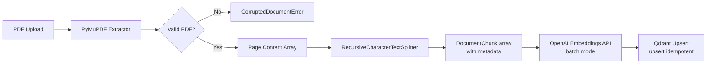
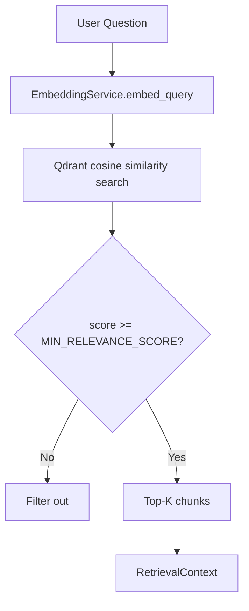
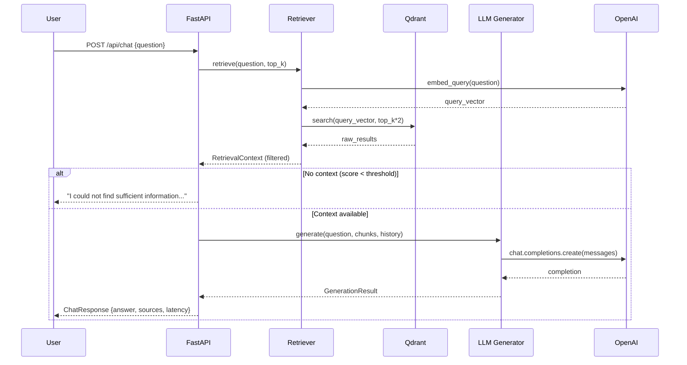
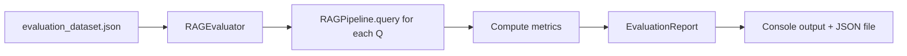

# Architecture — Enterprise RAG Knowledge Assistant

## Overview

This document describes the system architecture of the Enterprise RAG Knowledge Assistant.

---

## Ingestion Architecture



### Key design decisions:
- **SHA-256 document ID**: prevents duplicate ingestion
- **Page-level chunking**: each chunk knows its exact page
- **Chunk ID**: `{doc_id}_p{page}_c{chunk_idx}` → deterministic Qdrant point UUID (v5)
- **Batch embeddings**: reduces API calls and latency

---

## Embedding Architecture

The `EmbeddingService` is the sole place that calls OpenAI for embeddings.

- **Model**: `text-embedding-3-small` (1536 dimensions)
- **Batch size**: 32 (configurable via `EMBEDDING_BATCH_SIZE`)
- **Retry**: tenacity with exponential backoff, up to 5 attempts
- **Swap**: change `OPENAI_EMBEDDING_MODEL` without touching any other code

---

## Vector Search



- **Distance metric**: Cosine similarity
- **Default top-k**: 5 (configurable via `TOP_K`)
- **Over-fetch**: retrieves `top_k * 2`, then filters by threshold
- **Filtering**: optional `document_ids` filter for scoped retrieval

---

## RAG Pipeline



---

## LLM Generation

The system prompt enforces three critical rules:

1. **Context-only**: "Answer ONLY using information from the provided context."
2. **Explicit refusal**: "If the context does not contain enough information... say so exactly."
3. **Source citation**: "Always cite your sources using [Source: filename, Page N]"

---

## Source Citation

Each chunk carries `page_number` from the original PDF. After generation:
- Unique `(document_id, page_number)` pairs are deduplicated
- `SourceReference` objects are returned in the API response
- The frontend displays source cards with filename and page number

---

## Evaluation



Metrics computed:
- **Retrieval Hit Rate**: at least one expected source retrieved
- **Answer Correctness**: keyword overlap proxy
- **Citation Accuracy**: correct source cited
- **Avg Latency**: measured wall-clock time

---

## Deployment Architecture

```
Internet
    │
    ▼
nginx (port 80/443)
    │
    ├── /api/* → FastAPI (port 8000)
    │               │
    │               ├── Qdrant (port 6333)
    │               └── PostgreSQL (port 5432)
    │
    └── /* → React SPA (static files)
```

Docker Compose services:
- `api`: FastAPI with Uvicorn
- `qdrant`: Qdrant vector database with persistent volume
- `postgres`: PostgreSQL for document metadata
- `frontend`: Nginx serving built React app
